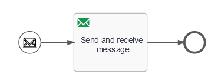

# Flowable-event-registry
Flowable event registry demo with RabbitMQ

## Prerequisites
RabbitMQ instalation with 3 queues defined:
* start-process
* receive-message
* send-message

## Example
1. To start process - send message on start-process queue

Set properties: `content_type : application/json`

```
{
    "id" : "randomId"
}
```
This action starts process. Next step is send and receive message task. Message is send to send-message queue automatically. Process stops and wait for message from RabbitMQ to continue.

2. To continue process - send message on receive-message queue

Set properties: `content_type : application/json`

```
{
    "id" : "randomId"
}
```
This action proceed process.

## Project description
### Technology and Tools
* Spring Boot
* H2 database
* Flowable
* Gradle
### Dependencies
* spring-boot-starter-amqp
* flowable-jms-spring-executor
* flowable-spring-boot-starter-process
### Code description
#### Event registry - `resources/eventregistry`
Inbound channel - `ch-in-*.channel`

Outbound channel - `ch-out-*.channel`

Inbound event - `ev-in-*.event`

Outbound event - `ev-out-*.event`
#### Process definition - `resources/processes`


Start event - `Start event registry event` - defined `Event key` and `Mapping from event payload`

Activities - `Send event task` - defined `Event key` and `Mapping to event payload`, to wait for response from message broker - set `Set service task to be triggerable` and define `Trigger event key` and `Mapping from event payload` 